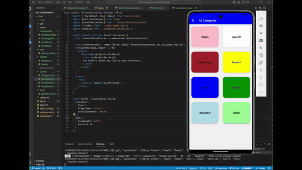

<h1>🌟 Excited to Share My Latest Project: A Restaurant Menu App Built with React Native! 🌟</h1>

I've just wrapped up a new project where I developed a fully functional restaurant menu application using React Native. This app enables users to easily browse through food categories, view detailed descriptions, and even mark their favorite dishes with just a tap.

<h2>🔧 Key Features:</h2>
-->Smooth Navigation: Implemented both React Navigation and Drawer Navigator for seamless user experience.  
-->Dynamic Screens: Designed category and food detail screens with responsive layouts and interactive components.  
-->Favorites Integration: Added a feature to mark favorite dishes, utilizing Context API for state management across the app.  
-->Data-Driven UI: Passed and displayed data across different screens using dynamic routing and parameterized navigation.  
-->This project was an amazing opportunity to deepen my knowledge of React Native while tackling real-world challenges like complex state management and smooth navigation.  

🚀 Looking forward to building more innovative solutions and sharing them with you all!

